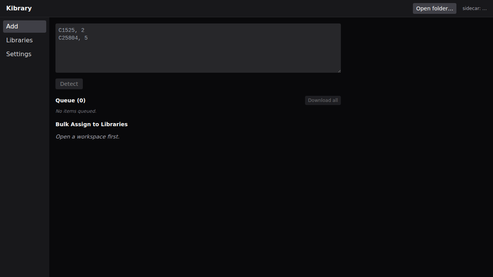

# Kibrary

**A modern desktop app that turns JLCPCB part numbers into committed KiCad libraries.**

Paste a list of LCSC codes, watch them download in parallel, review/edit each one before commit, and have everything land in your library repo as one git commit per part — automatically registered with your KiCad install.



---

## What it does

| Stage | What you do | What the app does |
|---|---|---|
| **Import** | Paste LCSC codes — `C1525, 2\nC25804, 5` or `C1525, C25804, C99999` | Parses BOM-vs-list format, dedupes, queues each part |
| **Download** | Hit "Download all" | Runs `JLC2KiCadLib` in parallel (4 by default), live status badges per part |
| **Review** | Pick a mode: sequential (one-by-one), pick-from-list, or **bulk-assign** (just confirm target libs, skip review) | Renders read-only previews via `kicanvas`, in-app editor for description/reference/value/datasheet, "Edit in KiCad" button hands off to the real editors with file-watcher refresh |
| **Commit** | Confirm target library | Merges into existing `_KSL` lib or creates a new one, writes `metadata.json`, **auto-commits to git** with a templated message |
| **Install** | Optional during first-run | Registers each library in KiCad's `sym-lib-table` and `fp-lib-table` (Linux Flatpak/regular, macOS, Windows) |

Everything that's app state lives in **human-readable JSON** under `<workspace>/.kibrary/` — no SQLite, no opaque blobs. Edit by hand if you want.

---

## Architecture in 30 seconds

```
┌────────────────────────────────────────────────────────────┐
│  Tauri app — single binary per OS, ~15-25 MB              │
│                                                            │
│   Frontend (SolidJS + Tailwind)                            │
│         │   tauri.invoke()                                 │
│         ▼                                                  │
│   Rust core    ── window, FS, settings, sidecar lifecycle  │
│         │   JSON-RPC over stdin/stdout                     │
│         ▼                                                  │
│   Python sidecar ── kiutils, JLC2KiCadLib, GitPython,      │
│                     httpx (search.raph.io), notify watcher │
└────────────────────────────────────────────────────────────┘
```

Why this stack: **fast cold-launch (~80ms target)** via Tauri (system webview, not Chromium), **Python sidecar** so we reuse the mature `kiutils` parser and `JLC2KiCadLib` CLI without rewriting them in Rust. See [`docs/superpowers/specs/2026-04-25-kibrary-redesign.md`](docs/superpowers/specs/2026-04-25-kibrary-redesign.md) for the full design.

---

## Features

### 1. Paste once, queue many
Single textarea handles two formats automatically:

```
C1525, 2          # BOM with quantities
C25804, 5
C9999             # qty defaults to 1

— or —

C1525, C25804, C9999    # plain comma-separated list
```

Invalid tokens get highlighted; valid ones still queue. No all-or-nothing.

### 2. Parallel downloads with live progress
4 concurrent `JLC2KiCadLib` invocations by default (configurable per workspace). Each part stages in its own `<workspace>/.kibrary/staging/<LCSC>/` folder so failures are isolated. Failed parts get a one-click Retry.

```
C234324  ━━━━━━━━━━ ready    [Review] [Commit]
C393943  ━━━━━━━━━╸  78%
C12345   ━╸           queued
```

### 3. Three review modes — pick what fits the batch

| Mode | When to use | Flow |
|---|---|---|
| **Sequential** | Mixed batch — careful review | One part fills the editor pane. Walk forward with `Commit & next` |
| **Pick** | Cherry-pick — only some need attention | Grid of cards, click to edit in-place |
| **Bulk assign** | Trusted parts (resistors, caps) — fast lane | Table view with auto-suggested target lib, one button to commit them all |

### 4. Library auto-suggestion from LCSC category
~40 JLCPCB categories map to ~18 sensible KSL libraries (Resistors, Capacitors, MCU, Connectors, Oscillators, …). Mapping ships as `~/.config/kibrary/category-map.json` — fully editable.

### 5. In-app properties + KiCad handoff for graphics
Description, Reference, Value, Datasheet, Footprint name — all editable in-app with **debounced 400 ms autosave**. For symbol/footprint geometry or 3D model offsets, the **"Edit in KiCad" button spawns the real KiCad editor** pointed at the staged file. A file watcher detects the save and refreshes the in-app preview instantly.

### 6. One commit per part — automatic
Workspace-level `git: { auto_commit: true }` flips on per-save commits with a templated message:

```
Add C25804 (100nF 0402 X7R) to Capacitors_KSL
```

Toast notification shows up after each commit with an **Undo** button (`git reset --hard HEAD~1`, only valid for ~30s and only if HEAD still matches).

Refuses to auto-commit if: not a git repo, dirty working tree outside the staged paths, mid-rebase/bisect/merge, detached HEAD.

### 7. Optional `search.raph.io` integration
If you have an account on [search.raph.io](https://search.raph.io) (a 3.5M-part JLCPCB/LCSC search engine), drop your API key into Settings and a search panel appears in the Add room with thumbnails and one-click `+ Add` to queue.

The app works fully offline-friendly without it.

---

## Quick start

### Run the legacy CLI (still works)

The original `kibrary_automator.py` script lives at the repo root and is unchanged through the P1 milestone. See [the CLI section below](#legacy-cli) for details. Most users should use the new desktop app.

### Run the desktop app (development build)

The repo ships a Docker dev container that has every toolchain pinned (Node 20 / Rust stable / Python 3.12 / KiCad / Xvfb / Playwright + Chromium). Recommended for clean reproducibility:

```bash
git clone https://github.com/jazari-akuna/kibrary-automator.git
cd kibrary-automator

# Build the dev image once (10–20 minutes)
docker compose -f docker-compose.dev.yml build dev

# Drop into a shell inside the container
docker compose -f docker-compose.dev.yml run --rm dev bash

# Inside the container — install deps, run the app
pnpm install
cd sidecar && python3 -m venv .venv && .venv/bin/pip install -e .[dev] && cd ..
pnpm tauri:dev:headless
```

Without the container, on a Linux/macOS host you need Node 20+, Rust 1.85+ (rustup), Python 3.12+, plus the Tauri 2 dev libs (`libwebkit2gtk-4.1-dev libgtk-3-dev libsoup-3.0-dev libssl-dev` on Debian/Ubuntu).

### First-run wizard

The first time you open a workspace, a 3-pane modal walks you through:

1. **Pick library workspace** — your `kicad-shared-libs/` folder
2. **Detect KiCad install** — the app auto-detects Flatpak / regular / macOS / Windows installs and lets you pick the target
3. **Git tracking** — auto-commit each save (default), track without auto-commit, or disable git tracking entirely

Settings re-editable any time from the Settings room.

---

## Examples

### Example A — bulk-assign 5 trusted parts in 30 seconds

1. Copy LCSC codes from JLCPCB cart: `C25804,C1525,C19920,C2040,C5446`
2. Paste into Kibrary's import box, hit **Detect** → "List, 5 valid"
3. **Queue all** → all 5 download in parallel (~5s total)
4. Switch review mode to **Bulk assign**, every row's suggested library is right (Capacitors_KSL, Resistors_KSL, Diodes_KSL, etc.)
5. Click **Save all 5 to libraries** → 5 git commits land in your repo, libraries auto-registered with KiCad

### Example B — careful review of one new MCU

1. Paste single LCSC: `C2040`
2. Download → status `ready`
3. **Sequential** review mode opens the symbol/footprint/3D previews + property editor
4. Set Description: "STM32G030F6P6 ARM Cortex-M0+ 32KB Flash 8KB SRAM"
5. Set Reference to `U?`
6. Hit **✎ Edit in KiCad** on the symbol preview → KiCad's Symbol Editor opens with the staged file → tweak pin labels → save → in-app preview re-renders instantly
7. Target library: pre-suggested `MCU_KSL`, accept
8. **Commit & next →** → one git commit, library registered, MCU available in KiCad

### Example C — paste a CSV BOM with quantities

```
# Cart export from JLCPCB
C1525, 100
C25804, 200
C19920, 50
```

Lines with `#` are comments. The `qty` field is preserved in `meta.json` for downstream tooling (BOM exports come in P3); for the commit-to-library flow only the LCSC matters.

---

## Project status & roadmap

**Currently shipped (P1 — MVP):** everything the screenshots show — paste import, parallel download, three review modes, in-app property editor + kicanvas previews + KiCad handoff, library commit + git auto-commit, KiCad install detection + table registration, first-run wizard, optional search.raph.io.

**Next (P2 — Library management):** browse / rename / move / delete components in already-committed libraries, library-level metadata editor, S-expression-aware diff preview before commit.

**Later (P3 — Polish):** signed installers (mac/win), auto-update, BOM block, JLC stock-check block, light/dark theme, search.raph.io batch endpoint, full STEP rendering.

Per-phase implementation plans live under [`docs/superpowers/plans/`](docs/superpowers/plans/).

---

## Library structure

Each `_KSL` library follows the KiCad PCM convention:

```
YourLibrary_KSL/
├── YourLibrary_KSL.kicad_sym          # Symbol definitions
├── YourLibrary_KSL.pretty/            # Footprint files
│   └── *.kicad_mod
├── YourLibrary_KSL.3dshapes/          # 3D models
│   ├── *.step
│   └── *.wrl
└── metadata.json                      # PCM metadata
```

3D model paths inside footprints use `${KSL_ROOT}/<lib>/<lib>.3dshapes/<file>` so the same library moves between machines without breaking. Set `KSL_ROOT` once in your KiCad path-substitutions to point at your library workspace.

---

## Headless screenshots

Capture any frontend route to PNG without ever opening a browser:

```bash
pnpm dev                          # Vite dev server in one terminal
ROUTE=/ pnpm screenshot           # → screenshots/index.png in another
```

The repo also bundles a [Storybook](https://storybook.js.org) configuration for per-block visual development:

```bash
pnpm storybook                                    # :6006
STORY=blocks-import--default pnpm screenshot:story
```

---

## Rust / Tauri dev environment

The Tauri backend (`src-tauri/`) requires **Rust 1.85 or newer** because Tauri 2's transitive dependencies (`toml`, `toml_edit`) need `edition2024`. Some Linux distros ship an older system `rustc` (Ubuntu's apt package is 1.75) alongside a newer rustup-managed toolchain. If `which cargo` points to `/usr/bin/cargo` rather than `~/.cargo/bin/cargo`, the system toolchain is active and `cargo check` may fail with confusing edition2024 errors from inside transitive crates.

Prepend `~/.cargo/bin` to your PATH to ensure rustup's toolchain is used:

```bash
export PATH="$HOME/.cargo/bin:$PATH"
```

Add it to your shell profile to make it permanent.

---

## Legacy CLI

The original `kibrary_automator.py` script remains at the repo root and works exactly as before. It will be removed at the end of P2 once the desktop app fully covers its workflows. Run it directly:

```bash
cd /path/to/your/kicad-shared-libs/
python3 /path/to/kibrary-automator/kibrary_automator.py
# When prompted, enter JLCPCB part numbers (space-separated)
# Example: C1525 C25804 R25604
```

```bash
# Install all libraries in the current directory to KiCad
python3 kibrary_automator.py install
```

---

## License

CC-BY-SA-4.0 — same as the kicad-shared-libs convention. See [`LICENSE.md`](LICENSE.md).
